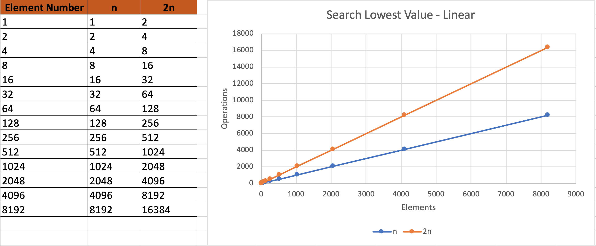
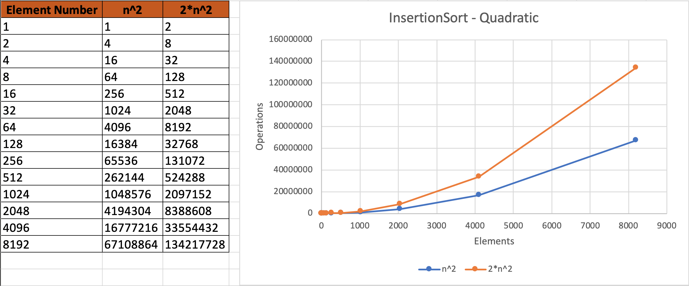
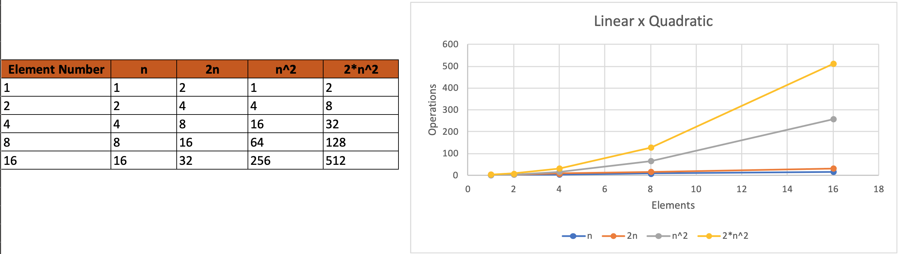
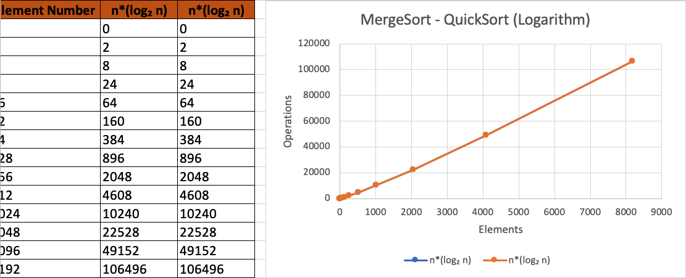
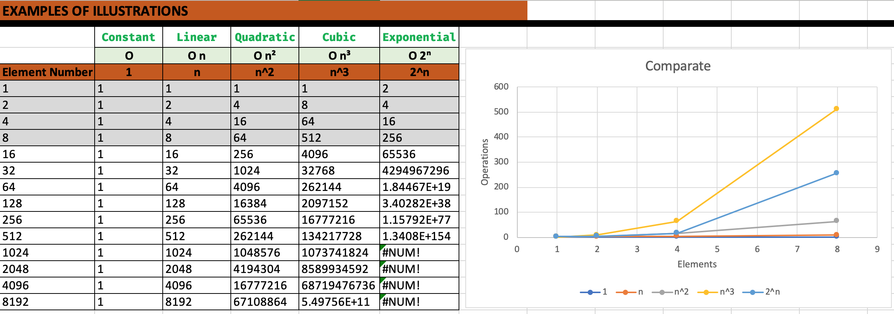

# Java Algorithms - Searching and Sorting

Implementation of search and ordering algorithms.

## Index :pushpin:

- [Searching Algorithms](#searching)
- [Sorting Algorithms](#sorting)
- [Tests](#tests)
- [Analyzing the Algorithms](#analyze)

## Searching Algorithms <a name="searching"></a>:mag_right:

#### Search Lowest Value

- Finding the lowest value in an array indicating the start and end of the search index.

```java
public int searchLowestValue(Car[] cars, int beginPosition, int endPosition) {
    int cheaper = beginPosition;
    for (int current = beginPosition; current <= endPosition; current++) {
        if (cars[current].getPrice() < cars[cheaper].getPrice()) {
            cheaper = current;
        }
    }
    return cheaper;
}
```

#### Pivot Search 

- ....

```java
public int breakPivot(Grade[] grades, int beginPosition, int endPosition) {
    Grade pivot = grades[endPosition - 1];
    int minorFound = 0;
    for (int analyze = 0; analyze < endPosition - 1; analyze++) {
        Grade gradeCurrent = grades[analyze];
        if (gradeCurrent.getValue() <= pivot.getValue()) {
            changePosition(grades, analyze, minorFound);
            minorFound++;
        }
    }
    changePosition(grades, endPosition - 1, minorFound);
    return minorFound;
}
```

#### Binary Search 

- ....

```java
public int binarySearch(Grade[] grades, int from, int to, double seeking) {
    int middle = (from + to) / 2;
    Grade grade = grades[middle];
    if (from > to) {
        return -1;
    }
    if (seeking == grade.getValue()) {
        return middle;
    }
    if (seeking < grade.getValue()){
        return binarySearch(grades, from, middle - 1, seeking); // Order Left
    }
    return binarySearch(grades, middle + 1, to, seeking);
}
```

#### Change Position

- Algorithm used to change the position of the array values.

```java
public void changePosition(Car[] cars, int from, int to) {
    Car carFrom = cars[from];
    Car carTo = cars[to];
    cars[from] = carTo;
    cars[to] = carFrom;
}
```

## Sorting Algorithms <a name="sorting"></a>:1234:

- Below are the ordering algorithms implemented in the project.

#### Selection Sort

- From the current pointer I scroll through my complete array and search for the lowest value and change positions.

```java
public Car[] selectionSort(Car[] cars, int numberOfElements) {
    SearchCar searchCar = new SearchCar();
    for (int current = 0; current < numberOfElements - 1; current++) {
        int lowestValue = searchCar.searchLowestValue(cars, current, numberOfElements - 1);
        changePosition(cars, current, lowestValue);
    }
    return cars;
}
```

#### Insertion Sort

- From the current element I compare if the value is smaller with the elements on the left, until I reach the right position.

```java
public Car[] insertionSort(Car[] cars, int numberOfElements) {
    for(int current = 1; current < numberOfElements; current++){
        int analyze = current;
        while (analyze > 0 && cars[analyze].getPrice() < cars[analyze-1].getPrice()){
            changePosition(cars, analyze, analyze-1);
            analyze--;
        }
    }
    return cars;
}
```

#### Merge Sort

- We take the complete array and divide it into two parts, and keep dividing them until we can no longer do them, we do the comparisons in blocks and in the end we compare the two divided blocks.

```java
public Grade[] mergeSort(Grade[] grades, int begin, int end) {
    order(grades, begin, end);
    return grades;
}

public void order(Grade[] grades, int begin, int end) {
    int numberOfElements = end - begin;
    if (numberOfElements > 1){
        int middle = (begin + end) / 2;
        order(grades, begin, middle); // order first middle (recursive)
        order(grades, middle, end); // order second middle (recursive)
        merge(grades, begin, middle, end); // merge two parts already ordered
    }
}

public void merge(Grade[] grades, int begin, int middle, int end) {
    Grade[] result = new Grade[end - begin];

    int current1 = begin;
    int current2 = middle; // from middle
    int currentPointer = 0;

    while (current1 < middle && current2 < end) {
        Grade grade1 = grades[current1];
        Grade grade2 = grades[current2];

        if (grade1.getValue() < grade2.getValue()){
            result[currentPointer] = grade1;
            current1++;
        } else {
            result[currentPointer] = grade2;
            current2++;
        }
        currentPointer++;
    }

    // first part of the array chosen to the middle
    while (current1 < middle){
        result[currentPointer] = grades[current1];
        currentPointer++;
        current1++;
    }

    // the middle to the end
    while (current2 < end){
        result[currentPointer] = grades[current2];
        currentPointer++;
        current2++;
    }

    // rest of itens for add
    for (int count = 0; count < currentPointer; count++){
        grades[begin + count] = result[count];
    }
}
```

#### Quick Sort

- ...

```java
public Grade[] quickSort(Grade[] grades, int begin, int end) {
    order(grades, begin, end);
    return grades;
}

public void order(Grade[] grades, int from, int to) {
    int elements = to - from;
    if (elements > 1){
        int pivotPosition = breakPivot(grades, from, to);
        order(grades, from, pivotPosition); // Order Left on Pivot
        order(grades, pivotPosition + 1, to); // Order Right on Pivot
    }
}
public int breakPivot(Grade[] grades, int beginPosition, int endPosition) {
    Grade pivot = grades[endPosition - 1];
    int minorFound = 0;
    for (int analyze = 0; analyze < endPosition - 1; analyze++) {
        Grade gradeCurrent = grades[analyze];
        if (gradeCurrent.getValue() <= pivot.getValue()) {
            changePosition(grades, analyze, minorFound);
            minorFound++;
        }
    }
    changePosition(grades, endPosition - 1, minorFound);
    return minorFound;
}
```

## Tests <a name="tests"></a>:white_check_mark:

- in progress...

## Analyzing the Algorithms <a name="analyze"></a>:chart_with_upwards_trend:

- Below are some analyzes of the implemented algorithms._[XLSX](resources/analysis_of_algorithms.xlsx)_
- Site References: _[BigO](https://www.bigocheatsheet.com)_
- Numbers are symbolic examples for analyzing the differences between the types of algorithms.

#### Search Lowest Value - Linear

- This algorithm we execute a 'for' that sweeps N elements, however we have an IF where we can also execute 2N.
- This algorithm is a linear algorithm, because I will always double, or quadruple and there will always be a linear line.



#### Selection Sort - Quadratic

- In this algorithm, we execute a 'for' that scans N elements, however, we have a call to another algorithm (search lowest value) where it can also have the same complexity already analyzed. So in this case we have N elements raised to 2 and we can have twice that.
- This algorithm is a quadratic algorithm, because when the number of elements increases, the operations grow in a quadratic, rather than linear way.


#### Insertion Sort - Quadratic

- In this algorithm, we execute a 'for' that sweeps N elements, where we can make N elements to the left too, however, we have a call to another algorithm (search for the lowest value), where it can also have the same complexity already analyzed. So, in this case, we have N elements increased to 2 and we can have twice that.
- This algorithm is a quadratic algorithm, because when the number of elements increases, the operations grow in a quadratic, rather than linear way.



#### Linear X Quadratic

- The linear algorithm is so low that we cannot see it, because the quadratic algorithm grows absurdly fast.
- In algorithm analysis we are always concerned with power, as it will make all the difference in the comparison.


- Example with few elements to visualize the lines of the linear algorithm.



#### Merge Sort - Quick Sort (Logarithm)

- MergeSort and QuickSort are of equal size, what should be analyzed are the smallest details, but analysts say that on average QuickSort is faster. Remembering that QuickSort uses Pivot for its algorithm.



#### Comparisons and Illustration/Demonstration

- We use the letter <kbd>O</kbd> to demonstrate the complexity of an algorithm, we call this analysis _`Asymptotic Analysis`_.

Demonstration examples:

- `O` -> Constant
- `O n` -> Linear
- `O n²` -> Quadratic
- `O n³` -> Cubic
- `O 2ⁿ` -> Exponential
- `O (log₂ n)` -> Logarithm (divide and conquer)

- Below are some examples of complexity of algorithms and their analysis in operations.


